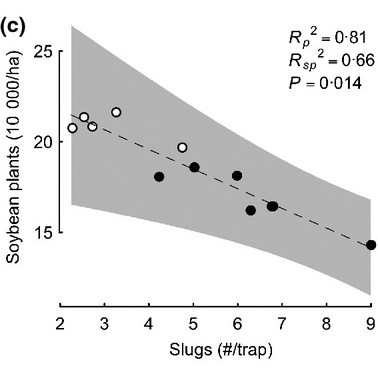

```{r setup, include=FALSE}
knitr::opts_chunk$set(echo = TRUE)
```

Example concepts taken from:
[Douglas et al., 2015. "Neonicotinoid insecticide travels through a soil food chain, disrupting biological control of non-target pests and decreasing soya bean yield." *Journal of Applied Ecology*.](https://besjournals.onlinelibrary.wiley.com/doi/full/10.1111/1365-2664.12372)

## Overview

### Day 1:

We will begin by ensuring that R was properly installed and then famaliarize ourselves with an R environment.

Next, we will simulate samples of slug and soybean densities based on a hypothesized relationship between slug herbivory and soybean seedling survival.

After that, we will visualize our and analyze our simulated data.

### Day 2: 

We will begin by adjusting the simulation settings and then explore how this might impact our analysis and conclusions.

Finally, you will be given a data set to investigate. Imagine this is data that you or another agroecologist collected from a real study! You will be asked to qualitatively and quantitatively summarize these data and make a conclusion about the relationship between slugs and soybeans. 

### Lab learning outcomes: 

Following the completion of the lab, students will be able to:

- Open an R programming environment, execute pre-written R scripts and interpret the outputs of these executions.  

- Read a graphical figure that shows a relationship between a continuous predictor (independent) variable and a continuous outcome (dependent) variable.

- Communicate the biological meaning of the intercept and slope estimates given by a linear regression statistical model.

- Understand how changes to true underlying relationships and to a data collection procedures impact the impact the qualitative and quantitative assessment of a hypothesis.

**You will be asked to submit responses to key prompts embedded in the activities below. There are _ labelled questions requiring response. Keep your responses in a word document and then submit this on canvas following the second day of the lab.**

\newpage

# Day 1 

### Day 1 - Part 1: Familiarize yourself with an R environment

Before we start with the activity, we will execute a few commands in R to ensure that R is installed properly and that we know how to navigate within an R environment. We will walk through Part 1 as a class with the TA showing navigation and operations on the projection screen. 

R commands can be executed in two different ways. First, you can paste or type a chunk of code directly into your console and the hit "enter" on your keyboard. Typing or pasting the following print() command in your console and then pressing "enter" should result in your console printing the input text. Entering the simple arithmetic operation below (2 + 2) will return the result of the operation, just as if you were using a calculator.  

```{r}
print("slugs eat soybeans")
2 + 2
```

Alternatively, you can create a .R file that holds lines of R script. You can select and then press "ctrl+enter" to execute one or more lines of code. This is a preferable way of interacting with R because it will allow you to save multiple lines of code and re-execute them whenever you like. Try creating a .R file in your working directory and then try the following operations by paste/type the next code chunk into your new .R file.

We might store the result of some command as a new object, say "x". After entering the first line of code, see if you can find the this new object and it's value within your programming environment. You should see it listed in the top right window pane if you are using RStudio. You can remove objects from the environment using the rm() command.

```{r}
x <- 2 + 2
x
rm(x)
```

If you wish to reproduce all outputs exactly as those generated by the TA you will need to initialize a random number generator and then run all code in sequence. It's ok if you you don't use the random number initialization, just be aware that your plots and model outputs won't be fully identical to those produced below. 

```{r}
set.seed(19) 
```

\newpage 

### Day 1 - Part 2: Simulate slug and soybean plant densities

#### Introduction 

Suppose we wanted to test the sub-hypothesis presented by Douglas et al. 2015: increasing slug densities reduce soybean densities because these herbivores eat (destroy) seedlings before they are able to grow into mature plants. As in Douglas et al., to test this hypothesis we might collect data on the density of slugs in a sample of soybean plots, predicting a negative relationship between slug density and soybean plant density.

Note to TA: As a class we will draw a diagram of our causal hypothesis. 

Douglas et al. indeed found a negative relationship, supporting this hypothesis (see figure 3c below). We will recreate this experiment ignoring the additional complexity of variation in neonicotinoid pesticides applied to sample plots. Douglas et al. used neonicotinoids to generate variation in slug densities. Here we might imagine a scenario where slug densities vary naturally among soybean plots.

Note to TA: As a class we will look at the fig 3c and identify the intercept, slope and random variation (precision) around the linear predictor. 



#### Simulation

Create some fake date using a simulation procedure. We will know the relationship between slugs and soybeans (because we will define it before generating our fake data!), and so our visualization and statistical models should return the known relationship that we expect. 

Start by defining the dimensions of our experiment. Let's use a sample size equivalent to the one used in the study we intend to replicate. Note that anything following a hashtag is ignored by R. Use hashtags to "commented out" your notes or describe your code without interfering with the R session.

```{r}
# specify a sample size (how many plots are included in the field experiment)
n <- 12
```

Next we will need to generate some values for our independent variable, the average density of slugs per trap in each of the *n* sample plots. Here we will use R's runif() command. runif() will take three arguments: (1) *n* or sample size; (2) a minimum value; and (3) a maximum value. Within the range of the minimum and maxium values, runif() will produce *n* random numeric values. The probability of generating any value within the range of the minimum and maximum is equal or "uniform".

```{r}
# specify a minimum number of slugs we might expect to see in a trap 
# (value estimated from fig 3c)
min_slugs_observed = 2
# specify a maximum number of slugs we might expect to see in a trap 
# (value estimated from fig 3c)
max_slugs_observed = 9
# simulate some slug trap data (independent variable), for n plots, 
# ranging from minimum to maximum values seen in the field experiment
slugs_per_trap <- runif(n=n, min=min_slugs_observed, max=max_slugs_observed)
```

Great we have some recorded data on slugs per trap! We could even print or plot these data to see the distribution of slug counts that we "recorded". The counts should be fairly evenly distributed within the range of 2 to 9 slugs given use of the runif() function.

```{r}
slugs_per_trap

hist(slugs_per_trap,
     main = "", 
     xlab = "slugs per trap",
     ylab = "frequency",
      xlim = c(0, 12))
```


**QUESTION 1: Why don't we have any plots with 11 or 12 slugs per trap?** 

Now that we have generated our independent variable data, we can generate dependent data based on a hypothesized relationship. We will assume that there is a linear relationship between slug density and soybean plant density (recall a *y = a + b(x)* slope-intercept equation from linear algebra). To simulate the outcome of such a relationship we will need to specify two terms: (1) an intercept, i.e., how many soybean plants might you expect to see in a plot given that there are zero slugs plot; (2) a slope, i.e., how much do you expect the density of soybean plants to change for every one unit increase in slugs per trap. 

```{r}
# specify an intercept term, i.e.,  
# density of soybean plants when there are zero slugs in traps
intercept <- 25 # units are in 10,000 plants / hectare

# specify a slope term, i.e., 
# a '_' change in soybean plant density associated with
# every increase of 1 slug per trap in the plot
effect_of_slug_increase <- -2 
```


**QUESTION 2: Our slope term of -2 infers a negative relationship between slugs per trap and soybean plant density. What would a slope term of 1 infer? How about a slope term of 0?** 

Finally, we will introduce a stochastic or random element to our slug-soybean association. In the real world, we might not expect perfect **precision** where a given slugs per trap measurement always corresponds to the exact same density of soybeans. Realistically, we might expect some plots to randomly deviate either slightly lower or slightly higher than expected given our intercept, slope and a measure of slugs per trap. 

Assuming normally distributed random variation (bell-curve shaped variation), the actual outcomes fall within 1 standard deviation of the expected value (*a + b(x)*) ~68% of the time and within 2 standard deviations of the expected value (*a + b(x)*) ~95% of the time. E.g. Our intercept of 25, slope of -2 and a measure of 5.5 slugs per trap is expected to yield *25 + -2(5.5) = 14(,000) soybean plants / hectare*. Due to random normal variation ~68% of the time plots with 5.5 slugs per trap will have 14 +/- 3 soybean plants / hectare; ~95% of the time plots with 5.5 slugs per trap will have 14 +/- 2*3 soybean plants / hectare.

Don't worry too much if this idea isn't immediately clear! We will follow up on this stochastic element on day 2 of the lab, seeing how increasing it or decreasing it changes our analysis. For now, we will define a standard deviation of 3. Assuming a normal or bell-curve shaped distribution variation

```{r}
# specify precision (how much does the response vary irrespective of the association)
sd <- 3 # standard deviation # units are in 10,000 plants / hectare
```

Now that we have defined all of the elements of our imaginary system we are ready to simulate some outcomes. We will simply combine the intercept, slope and measurements into a single linear predictor (again recall the *y = a + b(x)* formula). Use rnorm() function to generate soybean densities including both the linear predictor and an element of normally distributed random variation.

```{r}
# use rnorm() to simulate soybean plant densities 
# for "n" plots with 2 to 9 "slugs_per_trap slug" 
# an effect size of "effect_of_slug_increase"
# an intercept of "intercept"
# and a standard deviation of "sd"
linear_model <- (intercept + (effect_of_slug_increase * slugs_per_trap))
soybean_density <- rnorm(n=n, mean=linear_model, sd=sd)

# join the independent and dependent data into a single 'data frame' structure
mydata <- data.frame(slugs_per_trap, soybean_density)
```

### Day 1 - Part 3: Visualization and analysis of simulated data

#### Preliminary visualization

Before we quantitatively analyze patterns in our simulated data set, let's plot the data and conduct a qualitative assessment. 

```{r}
# create a plot using base R plotting tools
plot(x = mydata$slugs_per_trap, # independent variable
     y = mydata$soybean_density, # dependent variable
     cex = 1.75, pch = 21, bg = 'gray', # size, shape, and colour of the data points
     xlab = "Slugs (#/trap)", # x-axis title
     ylab = "Soybean plants (10,000/ha)", # y-axis title
     frame = FALSE, # remove frame
     xlim = c(min_slugs_observed, max_slugs_observed), # x-axis limits 
     ylim = c(0, 30) # y-axis limits
)
```

**QUESTION 3: Which axis (x or y) describes the variation in the independent variable? Which axis (x or y) describes the variation in the dependent variable?** 

**QUESTION 4: Look at the general trend in the data. Does change in soybean plant density associated with increasing slug counts track with your intuition?**

#### Analysis and final visualization

Quantify the association using a linear regression model. the lm() function will find the values of an intercept and slope that in combination have the highest likelihood of producing the data.

We can extract the estimates from the model fit summary.

```{r}
# fit a linear regression model to our data
# lm() fits a linear model 
summary(fit1 <- lm(formula = soybean_density ~ slugs_per_trap,
                   data = mydata))

# save important outputs
# intercept term
(estimate_intercept <- summary(fit1)$coefficients[1,1])
# effect of slug increase
(estimate_effect_of_slug_increase <- summary(fit1)$coefficients[2,1])

# We can also extract the R-squared value
# (definition)
(R2 <- summary(fit1)$r.squared)
```

Last, we will add predictions on our model estimates. Because we know the true values of the intercept and the slope that underly this slug - soybean association, we can assess the accuracy of our model fitting procedure.

```{r}
# now plot the fit (with confidence intervals)

# first we need to create some new data
# we will make predictions for the mean and confidence across the same range 
# of slugs that we "observed" in our simulation
min_slugs_observed <- min_slugs_observed
max_slugs_observed <- max_slugs_observed
slug_interval <- 0.5 # predict the values for every 0.5 slugs added

# now create some new independent data (slugs_per_trap)
# ranging from min to max and stepping up by interval
newdata <- data.frame(slugs_per_trap = seq(
  min_slugs_observed, max_slugs_observed, by=slug_interval))
# View(newdata) # you can view the new data set

# now predict the expected outcome for each value of slugs
# What is the expected soybean density of a plot given a particular slug density? 
pred <- predict(object=fit1, newdata, interval = 'confidence')

# create a plot using base R
# plot our simulated data
{
  plot(x = mydata$slugs_per_trap, # independent variable
     y = mydata$soybean_density, # dependent variable
     cex = 1.75, pch = 21, bg = 'gray', # size, shape, and colour of the data points
     xlab = "Slugs (#/trap)", # x-axis title
     ylab = "Soybean plants (10,000/ha)", # y-axis title
     frame = FALSE, # remove frame
     xlim = c(min_slugs_observed, max_slugs_observed), # x-axis limits
     ylim = c(0, 30) # y-axis limits
  )

  # plot the predicted mean response for a given number of slugs per trap
  lines(pred[,1] ~ newdata$slugs_per_trap, col = 'black', lwd = 2)
  
  # Confidence intervals - range in which the 'true' regression line lies 
  # given a certain level of confidence (default is 95% confidence).
  # Plot the 95% CI for the mean response across range of slugs per trap
  lines(pred[,2] ~ newdata$slugs_per_trap, col = 'blue', lty = 2, lwd = 2)
  lines(pred[,3] ~ newdata$slugs_per_trap, col = 'blue', lty = 2, lwd = 2)
  
  # Now let's add the 'true' regression line and see how close our model got
  expected_means <- intercept + effect_of_slug_increase * newdata$slugs_per_trap
  lines(expected_means ~ newdata$slugs_per_trap, col = 'red', lty = 2, lwd = 2)

}
```

**QUESTION 5: What is the estimated intercept and slope? How does this compare to the intercept and slope used to simulate the data? (Hint: compare the true mean relationship (red dashed line) to the confidence interval (blue dashed lines))**

**QUESTION 6: Why might the estimates given by our lm() call be slightly different from the ones we used to simulate the data?**

**QUESTION 7: What does the R-squared included in your model output tell you?**


\begin{center}
------------- END DAY 1 -------------
\end{center}

\newpage

# Day 2 

### Day 2 - Part 1: Adjust the simulation settings

### Day 2 - Part 2: Visualize and analyze some collected data
